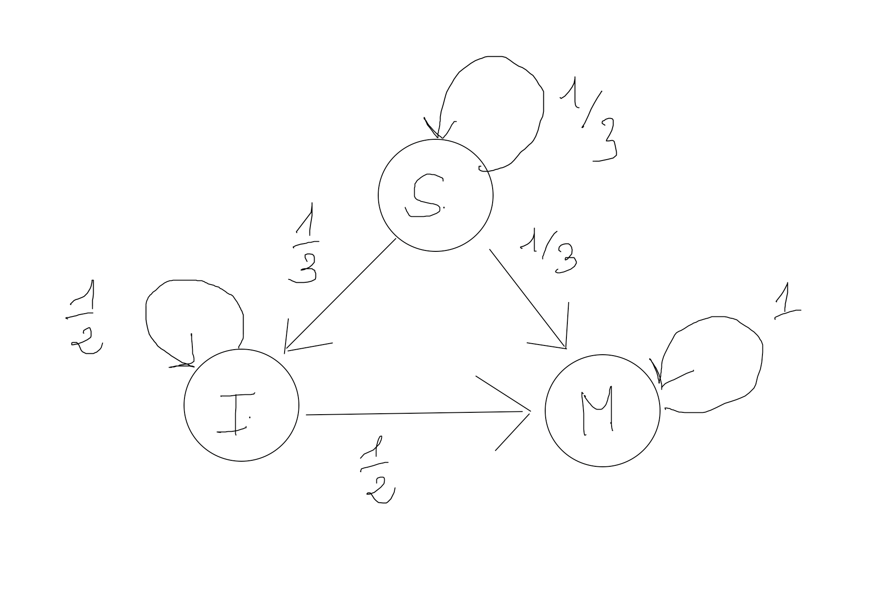

# TP 02

Dans un village une nouvelle maladie contagieuse non mortelle fait son apparition. Les individus de cette ville sont dans l'un des trois états suivants :

1. S l'individu est sain (non malade et non infecté).
2. I l'individu est sain mais infecté.
3. M l'individu est malade.

Un seul individu est à l'origine de la maladie sur les 100 personnes que compte la population totale. De plus l'état de chaque individu change selon le schéma suivant :

- Parmi les individus sains la proportion des individus qui deviennent porteurs sains est égale à 1/3 et 1/6 ceux qui deviennent malades.
- Parmi les individus porteurs sains la proportion des individus qui deviennent malades est 1/2.




On peut représenter la situation ci-dessus à partir d'une matrice P :
$P_{n+1}=P_n \times A$

1. Exprimez la matrice A du graphe ci-dessus en Numpy ainsi que le vecteur initial représentant l'état probabiliste de la maladie.

2. Créez une fonction **Pn** qui prend deux paramètres : v et A respectivement l'état précédent et A la matrice du graphe. Cette fonction retourne un vecteur probabiliste de dimension (3,)

3. Vérifiez par le calcul pour les 4 premières semaines que $P_4 = P_0*A^4$.

4. Quelle est la probabilité qu'un individu soit sain au bout de 4 semaines ?

5. On vaccine la population au bout de la quatrième semaine on a alors la matrice b suivante :

```python
b =  np.array([
    [ 5/12, 1/4, 1/3 ],
    [ 5/12, 1/4, 1/3 ],
    [ 1/6, 1/2, 1/3 ],
])
```

Dans la suite on exprimera l'état suivant : $Q_n = Q_0 \times b$

6. Exprimez sous forme vectorisée les états suivants : $s_5, i_5, m_5$.

7. Créez une fonction **nextProba** pour les probabilités suivantes $s_n, i_n et m_n$.
Notez que $P_4=Q_0$.

8. Calculez nextProba(2), nextProba(3), ... Que pouvez-vous en déduire sur l'état d'évolution de la maladie dans le village ?
