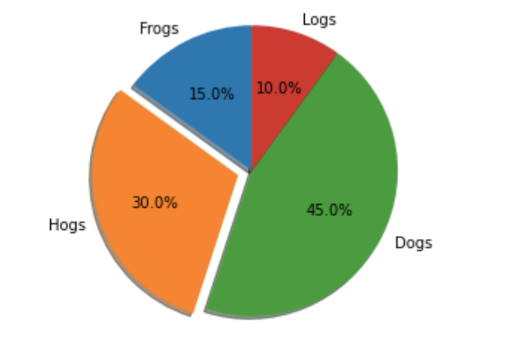

# Matplotlib

Matplotlib permet de générer des graphiques dans l'univers Python.

Pour créez des graphiques il existe deux méthodes : 

- fonctionnelle  

- objet

Nous abordons dans ce chapitre l'approche fonctionnelle dans ce premier chapitre sur ce sujet.

## Approche fonctionnelle

Pour tracer une courbe simple on utilise les foncitons plot et show

```python
import matplotlib.pyplot as plt
plt.plot([1, 2, 3, 4])
plt.ylabel('some numbers')
plt.show()
```

la fonction plot permet de réunir des points qui seront pas la suite tracés sur un graphique à l'aide de la méthode show.

```python
plt.plot([1, 2, 3, 4], [1, 4, 9, 16])
```

Vous pouvez définir des valeurs pour des axes en 2D x et y, notez l'option **ro** affichera des cercles rouges, c'est une manière de styliser la courbe, il y en a beaucoup d'autres.

```python
plt.plot([1, 2, 3, 4], [1, 4, 9, 16], 'ro')
# définir des valeur pour les axes x 0, 6 et y 0, 20 respectivement
plt.axis([0, 6, 0, 20]) 
plt.show()
```

Vous pouvez également tracez plusieurs graphiques dans la même grille :

```python
import numpy as np

# evenly sampled time at 200ms intervals
t = np.arange(0., 5., 0.2)

# red dashes, blue squares and green triangles
plt.plot(t, t, 'r--', t, t**2, 'bs', t, t**3, 'g^')
plt.show()
```

## Définir l'environnement de travail

```python
plt.style.use('seaborn-whitegrid');
```

### 01 Exemple complet de tracé de la fonction sinus

```python
import numpy as np
import matplotlib.pyplot as plt

fig = plt.figure()
ax = plt.axes()
x = np.linspace(0, 10, 1_000)
# le point virgule permet d'afficher le resultat dans un Notebook
ax.plot(x, np.sin(x));
```

- On peut également améliorer le style de la fonction directement dans les arguments de la fonction plot.

```python
plt.plot(x, np.sin(x - 1), color='blue', linestyle='solid', label='bleu')
```

- Définir les labels et titre

```python
# Label
plt.title("Un exemple de graphe")
# Placement de la légende
plt.legend(loc='lower left');

# labels des axes
ax = ax.set(xlabel='x', ylabel='sin(x)')
```

## L'objet figure

Vous pouvez également invoquer l'objet figure (conteneur) sur lequel vous pouvez alors tracer des graphiques.

```python
fig = plt.figure()
ax = plt.axes()
```

**fig** contient : axes, labels, données, ..

Par exemple, vous pouvez définir la taille de la grille où sera dessiner votre figure 

```python
plt.figure(figsize=(12,8))
```

### 02 Exemple complet, on peut ajouter d'autres figures sur l'objet figure lui-même

```python
import numpy as np
import matplotlib.pyplot as plt

# définit la taille
plt.figure(figsize=(12,8))

# définit un intervalle de valeurs entre 0 et 10 avec 1000 valeurs
x = np.linspace(0, 10, 1_000)

plt.plot(x, x**2, label="quadratique")
plt.plot(x, x**3, label="cubique")

plt.title('Figure 1')
plt.xlabel('axe x')
plt.ylabel('axe y')
# légende il faut les définir dans la fonction plot avant
plt.legend()

# Puis on peut également définir un autre objet conteneur pour afficher à la suite un autre graphique

plt.figure(figsize=(12,8))
plt.plot(x, x**5)
plt.show()
```

## Plusieurs graphiques dans une matrice de figure la fonction subplot

La fonction **subplot**, attention celle-ci n'a pas "s", il en existe une autre avec un "s" qui n'a pas le même sens (approche objet).

Les arguments de cette fonction se comprennent facilement :

**subplot(nrows, ncols, index, **kwargs)**

```python
# création de la figure
plt.figure()
# grille
plt.subplot(2,1,1)
plt.plot(x, x**2, c="red")
plt.subplot(2,1,2)
plt.plot(x, x**3, c="blue")
```

## Nuage de points

La fonction **scatter** définira un nuage de points :

```python
import numpy as np
import matplotlib.pyplot as plt

# définir une valeur de base sur laquel la fonction random créée des nombres pseudo aléatoire
np.random.seed(19680801)

N = 50
x = np.random.rand(N)
y = np.random.rand(N)
colors = np.random.rand(N)
area = (30 * np.random.rand(N))**2  # 0 to 15 point radii

plt.scatter(x, y, s=area, c=colors, alpha=0.5)
plt.show()
```

- Pour les styles on a beaucoup de possiblités, les paramètres suivants sont disponibles :

c : couleur "red", "black"
lw : épaisseur de ligne 
ls : -- pour des tirets
alpha : définir l'opacité des disques.


### Exemples avec le datasets Iris

Avec les légendes en plus ... Merci à Daniel

```python
import numpy as np
from sklearn import datasets

import matplotlib.pyplot as plt

# Datasets
iris = datasets.load_iris()

fig = plt.figure(figsize=(10, 8))

colors = ['b', 'c', 'y']
setosa = plt.scatter(
    iris.data[:,0][iris.target == 0], iris.data[:,1][iris.target == 0], color=colors[0],
    s = iris.data[:,2][iris.target == 0]*100, alpha=0.5
)
versicolor = plt.scatter(iris.data[:,0][iris.target == 1], iris.data[:,1][iris.target == 1], color=colors[1],
                         s = iris.data[:,2][iris.target == 1]*100, alpha=0.5
                        )
virginica  = plt.scatter(iris.data[:,0][iris.target == 2], iris.data[:,1][iris.target == 2], color=colors[2],
                         s = iris.data[:,2][iris.target == 2]*100, alpha=0.5
                        )

plt.legend((setosa, versicolor, virginica),
           (iris.target_names[0], iris.target_names[1], iris.target_names[2]),
           scatterpoints=1,
           loc='upper right',
           fontsize=12);
```


## 03 Exemple diagramme en secteur la fonction pie

```python
import matplotlib.pyplot as plt

# Pie chart, where the slices will be ordered and plotted counter-clockwise:
labels = 'Frogs', 'Hogs', 'Dogs', 'Logs'
x = [15, 30, 45, 10]

# séparer les secteurs
explode = (0, 0.1, 0, 0)  

plt.pie(x, explode=explode, labels=labels, autopct='%1.1f%%',
        shadow=True, startangle=90)
plt.title('Circle') 

plt.show()
```

Les paramètres de la fonction pie

- explode permet de séparer les secteurs

- autopct afficher les pourcentages sur les secteurs

- shadow met une ombre portée

- startangle permet de faire une rotation de la présentation des secteurs




### 04 Exemple bar pour tracer des histogrammes simples

```python
import matplotlib.pyplot as plt
fig = plt.figure()

langs = ['C', 'C++', 'Java', 'Python', 'PHP']
students = [23,17,35,29,12]
plt.bar(langs,students, 0.5, color='r')
plt.show()
```
