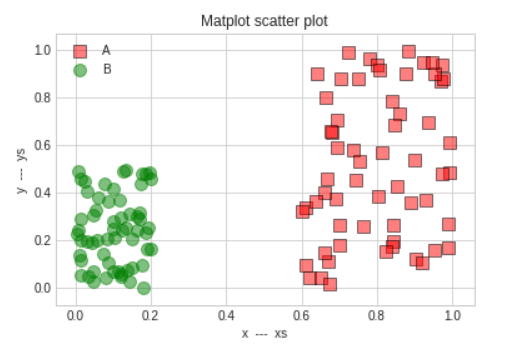
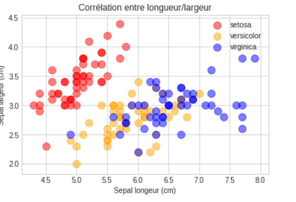

# Représenter un problème

## Introduction

Nous allons voir deux exercices probabilistes assez simples qui sont non intuitifs.

La représentation des données est très importante. John Snow un médecin du 19 ème sciècle a représenté sur une carte les morts dûs à une épidémie de choléra à Londre en 1854, il a également associé à cette carte les pompes à eau et a montré que l'épidémie venait de l'une d'entre elle.

## Représentation des données

Nous allons commencer par un petit exercice. Le but de celui-ci est de vous faire choisir le bon graphique pour essayer de mieux se représenter une situation donnée, afin de confirmer une approche théorique.

## Le problème des filles dans une famille de deux enfants

Considérons une famille avec deux enfants. Chaque enfant a autant de chance d’être une fille que d’être un garçon.

Le sexe du deuxième enfant est indépendant du sexe du premier.

1. L’enfant aîné est une fille. Quelle est la probabilité que les deux
enfants soient des filles ?

2. Au moins l’un des deux est une fille. Quelle est la probabilité que
les deux enfants soient des filles ?

Calculez ces probabilités de manière classique dans un premier temps. Puis simulez les deux questions en utilisant Numpy et matplotlib afin de confirmer l'approche théorique de ces deux questions.

```python
%matplotlib inline
import matplotlib.pyplot as plt
plt.style.use('seaborn-whitegrid')
import pandas as pd
import numpy as np

# Représentation graphique
fig=plt.figure(figsize=(7,5))
```

## Problème de Monty Hall

Le jeu oppose un maître de jeu à un joueur. Ce joueur est placé devant trois portes fermées. Derrière l'une d'elles se trouve un super cadeau et derrière chacune des deux autres il n'y a strictement rien. Il doit tout d'abord désigner une porte, sans l'ouvrir. Le joueur gagne s'il trouve la bonne porte.

Une fois le choix du joueur connu, le maître du jeu élimine une des deux portes restantes qui ne contient pas le super cadeau. Si le super cadeau ne se trouve pas derrière les deux portes restantes, il élimine au hasard une des deux portes. Bien sûr le joueur ne connait pas le détail de ce jeu, seul le maître du jeu connait l'emplacement du super cadeau.

A ce moment du jeu le joueur peut encore choisir : soit garder son premier choix, soit choisir la porte restante.

Quelles sont ses chances de gagner le super cadeau en agissant au mieux ?

Représentez ce jeu à l'aide d'un script Python en choisissant le bon type de graphique pour représenter ce problème. Concluez à partir de cette représentation.

Calculez les probabilités et essayez de confirmer la théorie par un graphique.

## Bilan

La probabilité qu'il choisisse la bonne porte sans changer son premier choix est de 1/3. Supposons maintenant qu'il choisisse la dernière porte proposée, le maître du jeu a 2/3 de chance de récupérer la bonne porte. Ainsi si le joueur choisit le choix du maître du jeu il aura également 2/3 de chance de trouver le super cadeau.

Pour terminer, faites un graphique pour confirmer ces probabilités.

## Représentation en nuage de points

Un nuage de points nous permettra classiquement de voir si deux quantités semblent corrélées.

Voici un exemple pour représenter un nuage de points. Nous représentons deux datasets (x, y) sur le même graphique. Lisez les commentaires pour comprendre les différents paramètres d'un nuage de points dans matplotlib.
Notez que nous pouvons également partir d'un DataFrame de Pandas pour représenter un nuage de points, voyez le deuxième exemple.

```python
import numpy as np
import matplotlib.pyplot as plt

xs = np.random.rand(N)
ys = np.random.rand(N)

g1 = (0.6 + 0.4 * xs, 1*ys)
g2 = (0.2*xs, 0.5*ys)

data = (g1, g2)
colors = ("red", "green")
groups = ("A", "B")
markers = ("o", "s")

# Create plot
plt.style.use('seaborn-whitegrid')
fig = plt.figure(figsize=(7,5))

ax = fig.add_subplot(1, 1, 1)

for data, color, group, marker in zip(data, colors, groups, markers):
    x, y = data
    ax.scatter(x, y, alpha=0.5, c=color, edgecolors='black', marker=marker, s=100, label=group)

plt.title('Matplot scatter plot')
plt.xlabel('x  ---  xs')
plt.ylabel('y  ---  ys')
plt.legend(loc=2)
plt.show()
```

## Exercice Représentation

Utilisez directement à partir d'un objet de type DataFrame la méthode plot.

*Indications : vous pouvez suivre la démarche suivante : créez un np.array et transposez ce dernier, définissez des colonnes et enfin créez votre DataFrame.
Pour la représentation vous pouvez suivre la remarque suivante :*

```python
# Pour représenter deux graphes
# sur le même graphe
ax = df1.plot()
# ax axe ou subplot (sous graphe)
df2.plot(ax=ax)
```



## Les iris

Les données utilisées ici sont célèbres. Elles ont été collectées par Edgar Anderson. Ce sont les mesures en centimètres des variables suivantes : longueur du sépale (sepal length), largeur du sépale (sepal width), longueur du pétale (petal length) et largeur du pétale (petal width) pour trois espèces d'iris : **Iris setosa**, **I. versicolor** et **I. virginica**.

Sir R.A. Fisher a utilisé ces données pour construire des combinaisons linéaires des variables permettant de séparer au mieux les trois espèces d'iris.

Ce dataset est présent dans **skearn** (module de Data Analyst).

```python
import pandas as pd
import numpy as np
# On récupère uniquement le dataset iris
from sklearn.datasets import load_iris
# C'est un dictionnaire
iris = load_iris()

# Les clés du dictionnaires
iris.keys()
```

### Exercice nuage de point

Nous allons essayer de visualiser une corrélation entre la longueur et la largeur des sépales des trois espèces d'iris. Utilisez un DataFrame Pandas pour faire cette représentation graphique.

Vous ferez un deuxième graphique par rapport aux pétales pour voir si il y a également une corrélation.

Pour les sépales on doit avoir un graphique comme suit :



### Diagramme à moustache

Le diagramme à moustache résume quelques indicateurs de position d'un caractère étudié :

- Premier quantile 25%.
- Médiane.
- Troisième quantile 75%.
- Minimum.
- Maximun.

Ce diagramme est utilisé pour comparer un même caractère dans deux populations de tailles éventuellement différentes.

Propriétés du diagramme :

- Dans la boîte on a 50% des données.
- La longueur des moustaches est de 1.5 fois l'intervalle interquartile

Dans Matplotlib vous utiliserez la méthode : **boxplot**.

### Exercice nombre de but(s)

Voici un tableau présentant le nombre de matchs ayant gagné un certain nombre de buts :

| nombre buts | 0  |  1  | 2  | 3  | 4  | 5 | 6 | 7 |
|-------------|----|-----|--- |----|----|---|---|---|
| nombre match| 7  | 17  | 13 | 14 | 8  | 6 | 0 | 1 |

Représentez ces données à l'aide d'un diagramme en moustache.

### Exercice naissance

Récupérez le dataset suivant : [base comparateur de territoires](https://www.insee.fr/fr/statistiques/2521169#consulter)

1. Faites une représentation en box-plot du nombre de naissances par habitant en fonction du département en Île-de-France en dehors de Paris.
