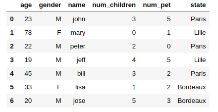
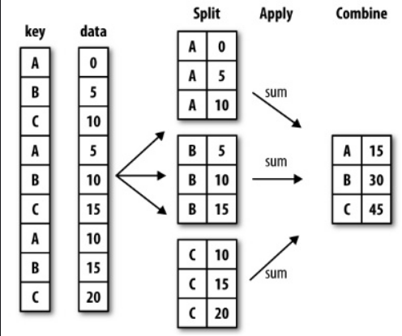
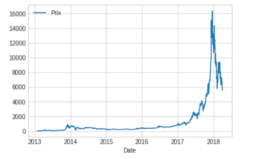
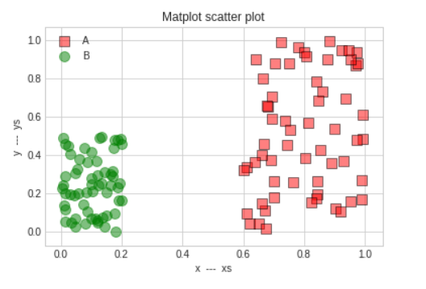

# DataFrame

## Définition

Un Dataframe est semblable à un dictionnaire dont les clés sont les noms des colonnes (columns) et les valeurs des séries. Vous pouvez également définir des index spécifiques.

```python
temperatures = np.array([
    [25, 28.5, 30],
    [33, 29, 35],
    [38, 39, 44],
])

# Def des index et colonnes
temperatures_df = pd.DataFrame(
    temperatures,
    index = ['Bordeaux', 'Paris', 'Lille'],
    columns = ['2001', '2002', '2003', 'tendance']
)
```

L'objet **temperatures_df** est un tableau (DataFrame) à deux dimensions :

```txt
	        2001	2002	2003
Bordeaux    25.0	28.5	30.0
Paris	    33.0	29.0	35.0
Lille	    38.0	39.0	44.0
```

Voici quelques fonctions élémentaires pour commencer sur les DataFrames :

- df.info() : information sur le DataFrame.
- df.head(2) : Deux premières lignes du DataFrame.
- df.head(), df.tail() : les 5 premières ou les 5 dernières (par défaut df.head(n = 5) et df.tail(n=5))
- df.columns : noms des colonnes : Index(['Paris', 'Lille', 'Bordeaux'], dtype='object').
- df.columns.values : Noms des colonnes dans un array Numpy.
- df.index : Noms des lignes.
- df.index.values : Noms des lignes dans un array Numpy.
- df.values : DataFrame dans un array 2d Numpy.
- df.describe() : statistiques sur les colonnes numériques (moyenne, écart-type, ...)
- df.shape : donne les dimensions du DataFrame.

## Construire un DataFrame avec un dictionnaire

Voici comment vous pouvez construire un **DataFrame** facilement à partir d'un dictionnaire en Python, les clés sont les noms des colonnes :

```python
import pandas as pd

dataset = {
    'name':['john','mary','peter','jeff','bill','lisa','jose'],
    'age':[23,78,22,19,45,33,20],
    'gender':['M','F','M','M','M','F','M'],
    'city':[
        'Paris','Lille',
        'Paris','Lille','Paris',
        'Bordeaux','Bordeaux'
    ],
    'num_children':[3,0,2,4,3,1,5],
    'num_pet':[5,1,0,5,2,2,3]
}

df = pd.DataFrame(dataset)
df.head(7)
```

Ici on ne précise pas d'index pour le DataFrame, Pandas utilisera par défaut un index numérique :



## Sélectionner des valeurs dans le DataFrame

### Méthode [] : df[]

```python
# Chaque clé est le nom d'une colonne
# Chaque liste Python contient les valeurs de la colonne
data = {
    'city': ['Lille', 'Paris', 'Lyon', 'Marseille', 'Aubenas'],
    'year': [2000, 2001, 2002, 2001, 2020],
    'pop': [0.232, 2.141, 0.513, 0.861, 0.012]
}

df = pd.DataFrame(data, index=['59', '75', '69', '13', '07'])

print(df)

"""
        city  year    pop
59      Lille  2000  0.232
75      Paris  2001  2.141
69       Lyon  2002  0.513
13  Marseille  2001  0.861
07    Aubenas  2020  0.012

"""
```

Pour accéder à la première colonne "city" on pourra utiliser la syntaxe suivante :

```python
df['city']

"""
59        Lille
75        Paris
69         Lyon
13    Marseille
07      Aubenas
"""
```

Si on souhaite accéder à plusieurs colonnes, par exemple ici à deux colonnes en même temps, on écrira :

```python
df[ ['city', 'year'] ]
"""
    city	year
59	Lille	2000
75	Paris	2001
69	Lyon	2002
13	Marseille	2001
07	Aubenas	2020
"""
```

Vous pouvez utiliser la notion de mask avec un DataFrame, ici on sélectionnera les villes ayant plus de 500 000 habitants :

```python
df[ df['pop'] > 0.5 ]
"""
        city  year    pop
75      Paris  2001  2.141
69       Lyon  2002  0.513
13  Marseille  2001  0.861
"""
```

Attention le slicing numérique sert uniquement à sélectionner des lignes :

```python
df[0:2]
"""
     city  year    pop
59  Lille  2000  0.232
75  Paris  2001  2.141
"""
```

### Méthode loc : df.loc[row] et df.loc[row, column]

La méthode .loc utilise les étiquettes de ligne et de colonne : loc[ row, column]

```python
df.loc['59']
"""
city    Lille
year     2000
pop     0.232
"""
```

Vous pouvez à l'aide de cette dernière syntaxe faire du slicing sur les index :

```python
df.loc['75':'07']

"""
        city  year    pop
75      Paris  2001  2.141
69       Lyon  2002  0.513
13  Marseille  2001  0.861
07    Aubenas  2020  0.012
"""
```

On peut également sélectionner ligne(s) et colonne(s) :

```python

df.loc['75':'07', 'pop']

"""
75    2.141
69    0.513
13    0.861
07    0.012
"""
```

Un autre exemple de sélection :

```python
df.loc['75':'07', 'city': ]
```

### Méthode iloc : iloc[row, column] row et column indexés seulement numériquement

```python
# row, column
df.iloc[1:, 1:]
"""
    year    pop
75  2001  2.141
69  2002  0.513
13  2001  0.861
07  2020  0.012
"""
```

## Exercice création de DataFrame

Créez les DataFrames suivants :

1. DataFrame **fruits1**

```txt
---------------------------------
|   |   Rapsberry | Cherries    |
---------------------------------
| 0 |   30        |  20         |
---------------------------------
```

2. DataFrame **fruits2**

```txt
------------------------------------
|       |   fig       |     wine    |
------------------------------------
| 2020  |   130       |  120        |
------------------------------------
| 2019  |   309       |  290        |
------------------------------------
```

## Exercices manipulation des index & column

Remplacez à l'aide de la méthode replace de Pandas les données manquantes par np.nan de Numpy :

```python
df = pd.DataFrame(
    [
        [1, "2", None, 3], 
        [4, None, "5", 6],
        [7, 8, 9, 10], 
        ["None", "", None, "NAN"],
    ],
    index=['a', 'b', 'c', 'd'],
    columns = ['A', 'B', 'C', 'D']
)

```

## Exercice convertir un array Numpy en DataFrame

Redimensionnez la série suivantes en un DataFrame de dimension 3 lignes 5 colonnes, nommez les lignes a, b, c et les 5 colonnes avec d e f g h :

```python
A = pd.Series(np.random.randint(1, 10, 15))
```

## Exercice appliquer une fonction à un DataFrame

Soit le DataFrame C suivant :

```python

C = pd.DataFrame( np.random.randn(5, 5), columns=list("abcde"), index=list("fghij" ))

```

1. Mettez l'ensemble des valeurs en valeur absolue. Utilisez la fonction np.abs de Numpy.

2. Calculez l'amplitude des valeurs sur les lignes puis les colonnes. Vous pouvez utiliser la fonction apply sur le DataFrame.

## Exercice somme et remplacement

Soit le DataFrame suivant :

```python
C = pd.DataFrame( np.random.randn(5, 5), columns=list("abcde"), index=list("fghij"))
```

1. Faites la somme de toutes les valeurs négatives de C.

2. Remplacez dans la colonne b les valeurs négatives par la moyenne des valeurs positives de la colonne.

## Exercice Matrice et recherche

1. Soit le tableau de valeurs numériques suivant. En utilisant la variable data ci-après construisez le DataFrame correspondant, respectez les noms des étiquettes (lignes et colonnes).

```text
 A   B   C   D   E   F   G   H   I   J
a  13  54  23  23  62  29  53  15  54  67
b  13  54  23  23  62  29  53  15  54  67
c  98  36  34  40  13  92  41  61  94  62
d  33  87  46  44  82  87  11  76  76  21
e  56  16  13  91  64  13  77  44  44  27
f  56  16  13  91  64  13  77  44  44  27
g  15  87  20  50  53  48  39  38  91  32
h  93  48  28  27  50  55  28  38  78  85
i  76  58  26  89  88  71  97  80  42  52
j  76  58  26  89  88  71  97  80  42  52
k  38  98  55  61  75  82  37  64  87  83
l  24  53  16  84  82  13  18  18  82  51
```

```python
 
data = [ 
    [13,  54,  23,  23,  62,  29,  53,  15,  54 , 67],
    [13,  54,  23,  23,  62,  29,  53,  15,  54,  67],
    [98,  36,  34,  40,  13,  92,  41,  61 , 94,  62],
    [33,  87,  46,  44,  82,  87,  11,  76,  76,  21],
    [56,  16 , 13,  91,  64,  13,  77,  44,  44,  27],
    [56,  16 , 13,  91,  64,  13,  77,  44,  44,  27],
    [15 , 87,  20,  50,  53,  48,  39,  38,  91,  32],
    [93,  48,  28,  27,  50 , 55 , 28 , 38  ,78 , 85],
    [76,  58 , 26  ,89 , 88  ,71 , 97 , 80,  42,  52],
    [76,  58 , 26  ,89 , 88  ,71 , 97 , 80,  42,  52],
    [38,  98,  55,  61,  75,  82 , 37,  64,  87,  83],
    [24,  53,  16,  84,  82,  13,  18,  18,  82,  51],
]
```

2. Recherchez toutes les lignes identiques dans le DataFrame et supprimez les. Vous pouvez utiliser la méthode **duplicated** sur le DataFrame.

3. Comptez les occurences de chaque valeur dans le DataFrame. Placez le résultat de ce comptage dans un dictionnaire voir ci-dessous :

*Indications : vous pouvez parcourir le DataFrame avec la méthode A.iterrows(), sur les étiquettes valeurs. Pensez à utiliser également les méthodes : count et sum.*

```python
stat ={13: 5, 54: 2, 23: 2, 62: 2, 29: 1, 53: 3, 15: 2, 
67: 1, 98: 2, 36: 1, 34: 1, 40: 1, 92: 1, 41: 1, 
61: 2, 94: 1, 33: 1, 87: 4, 46: 1, 44: 3, 82: 4, 
11: 1, 76: 3, 21: 1, 56: 1, 16: 2, 91: 2, 64: 2, 
77: 1, 27: 2, 20: 1, 50: 2, 48: 2, 39: 1, 38: 3, 
32: 1, 93: 1, 28: 2, 55: 2, 78: 1, 85: 1, 58: 1, 
26: 1, 89: 1, 88: 1, 71: 1, 97: 1, 80: 1, 42: 1, 
52: 1, 75: 1, 37: 1, 83: 1, 24: 1, 84: 1, 18: 2, 
51: 1}
```

4. Faites la somme des nombres pairs de chaque ligne.

## Exercice introduction aux notions d'agrégation

1. En utilisant **np.arange** et la méthode **.reshape** qui permet de changer les dimensions d'un array, générez la matrice A ci-dessous. Puis calculez les moyennes par lignes et colonnes de A en transposant la matrice. Voir un exemple de transposition ci-après.

Matrice A

```pyhton
  A  B  C  D  E  F  G  H  I
a 1  2  3  4  5  6  7  8  9 
b 2  4  6  8 10 12 14 16 18 
c 3  6  9 12 15 18 21 24 27 
d 4  8 12 16 20 24 28 32 36 
e 5 10 15 20 25 30 35 40 45 
f 6 12 18 24 30 36 42 48 54 
g 7 14 21 28 35 42 49 56 63 
h 8 16 24 32 40 48 56 64 72 
i 9 18 27 36 45 54 63 72 81
```

Transposition d'une matrice, elle change les dimensions des lignes/colonnes en colonnes/lignes

```python
C = pd.DataFrame( { "A" : [1, 2, 3, 4], "B" : [5, 6, 7, 8] } )

# Matrice B dimension 4 X 2
C
"""
   A  B
0  1  5
1  2  6
2  3  7
3  4  8
"""

C.T
"""
0  1  2  3
A  1  2  3  4
B  5  6  7  8
"""
```

Lorsque vous calculez la moyenne par ligne ou colonne d'un DataFrame, Pandas agrège les données pour effectuer ses calculs.

```python

# Agrégation de toutes les lignes
A.mean(axis = 0)

# Agrégation de toutes les colonnes
A.mean(axis = 1)

```

2. Ajoutez la matrice B à la seule colonne possible de la matrice A. Faites ensuite la somme en lignes, puis en colonnes en utilisant la notion de transposition.

```python
B = pd.DataFrame([11, 6, 4, 8, 0, 9, 7, 8, 13], index=list("abcdefghi"), columns=['A'])
```

3. Calculez les pourcentages des valeurs par ligne, puis par colonne en utilisant la technique de la transposée.

--------------------------------------------------------------

## Group By

La méthode **groupby** sur un objet Pandas permet de regrouper des données en fonction d'une colonne ou de plusieurs colonnes. Elle permet alors d'appliquer une fonction d'aggrégation sur ce groupe, comme par exemple la moyenne ou une somme.

Le **groupby** est similaire dans sa définition au groupby SQL que nous verrons par la suite.

```python

df = pd.DataFrame({
    'Animal': [
    'Falcon', 'Falcon',
    'Parrot', 'Parrot'
    ],
    'Max Speed': [380., 370., 24., 26.]
})

df.groupby(['Animal'])

```

Une fois que vous avez groupé les valeurs par nom de colonne ou de lignes, vous pouvez appliquer une fonction d'agrégation :

```python
df.groupby(['Animal'])
.aggregate(lambda x : sum(x))
```


Voic le schéma général du groupby dans Pandas :



\newpage

## Exercice de regroupement par pays

1. Reprenez le dataset suivant et donnez le nombre d'enfant(s) par ville dans un tableau à deux colonnes **city** & **num_children**.

2. Quel est l'écart des ages des habitants par ville ?

```python
dataset = {
    'name':['john','mary','peter','jeff','bill','lisa','jose'],
    'age':[23,78,22,19,45,33,20],
    'gender':['M','F','M','M','M','F','M'],
    'city':['Paris','Lille','Paris','Lille',
    'Paris','Bordeaux','Bordeaux'],
    'num_children':[3,0,2,4,3,1,5],
    'num_pet':[5,1,0,5,2,2,3]
}
```

## Exercice &Eacute;cart de salaires

Vous allez maintenant étudier l'écart des salaires des habitants de la ville de Boston par département sur l'année 2018. Récupérez le fichier csv à l'adresse suivante :
[Analyse Boston](https://data.boston.gov/dataset/employee-earnings-report/resource/31358fd1-849a-48e0-8285-e813f6efbdf1)

Puis une fois dans votre notebook tapez la ligne de code suivante pour importer les données dans un DataFrame :

```python
# DataFrame
boston = pd.read_csv('../data/boston.csv')
```

### Préparation des données

1. Formatez les données de la colonne TOTAL EARNINGS pour les rendre compatibles avec un type numérique. Vous utilisez la méthode astype, voyez exemple ci-dessous :

```python
df[colunm].astype(float)
```

2. Ordonnez les écarts par ordre décroissant.

## Exercice Bitcoin

Récupérez les sources sur le serveur.

Affichez les données :

```python
bitcoins =pd.read_csv('data/Cours_BTC2FEUR_-_Feuille_1.csv')
bitcoins.head()
```

1. Nettoyer la colonne Prix pour avoir cette colonne dans le type flaot.

2. Représentez graphiquement le cours du Bitcoin.



## Exercice Nuage de points

Soit le dataset suivant :

```python

dataset = {
    'name':['john','mary','peter','jeff','bill','lisa','jose'],
    'married' : ['yes', 'yes', 'no', 'yes', 'no', 'no', 'yes', 'no'],
    'age':[23,78,22,19,45,33,20],
    'genre':['M','F','M','M','M','F','M'],
    'state':['Paris','Lille','Paris','Lille','Paris','Bordeaux','Bordeaux'],
    'num_children':[3,0,2,4,3,1,5],
    'num_pet':[5,1,0,5,2,2,3]
}

```

1. Affichez par état le nombre d'enfant(s).

2. Affichez par état le nombre d'enfant(s) des couples mariés.

3. Est-ce que les personnes mariées ont plus d'enfant(s) ?

4. Est-ce que les personnes divorcées ont plus de chien que les couples mariés ?

5. Calculez la moyenne du nombre d'enfant(s) chez les couples divorcés.

-------------------------------


# Représenter un problème

Nous allons voir deux exercices probabilistes assez simples qui sont non intuitifs.

La représentation des données est très importante. John Snow un médecin du 19 ème sciècle a représenté sur une carte les morts dûs à une épidémie de choléra à Londre en 1854, il a également associé à cette carte les pompes à eau et a montré que l'épidémie venait de l'une d'entre elle.

## Représentation des données

Nous allons commencer par un petit exercice. Le but de celui-ci est de vous faire choisir le bon graphique pour essayer de mieux se représenter une situation donnée, afin de confirmer une approche théorique.

## Le problème des filles dans une famille de deux enfants

Considérons une famille avec deux enfants. Chaque enfant a autant de chance d’être une fille que d’être un garçon.

Le sexe du deuxième enfant est indépendant du sexe du premier.

1. L’enfant aîné est une fille. Quelle est la probabilité que les deux
enfants soient des filles ?

2. Au moins l’un des deux est une fille. Quelle est la probabilité que
les deux enfants soient des filles ?

Calculez ces probabilités de manière classique dans un premier temps. Puis simulez les deux questions en utilisant Numpy et matplotlib afin de confirmer l'approche théorique de ces deux questions.

```python
%matplotlib inline
import matplotlib.pyplot as plt
plt.style.use('seaborn-whitegrid')
import pandas as pd
import numpy as np

# Représentation graphique
fig=plt.figure(figsize=(7,5))
```

## Problème de Monty Hall

Le jeu oppose un maître de jeu à un joueur. Ce joueur est placé devant trois portes fermées. Derrière l'une d'elles se trouve un super cadeau et derrière chacune des deux autres il n'y a strictement rien. Il doit tout d'abord désigner une porte, sans l'ouvrir. Le joueur gagne s'il trouve la bonne porte.

Une fois le choix du joueur connu, le maître du jeu élimine une des deux portes restantes qui ne contient pas le super cadeau. Si le super cadeau ne se trouve pas derrière les deux portes restantes, il élimine au hasard une des deux portes. Bien sûr le joueur ne connait pas le détail de ce jeu, seul le maître du jeu connait l'emplacement du super cadeau.

A ce moment du jeu le joueur peut encore choisir : soit garder son premier choix, soit choisir la porte restante.

Quelles sont ses chances de gagner le super cadeau en agissant au mieux ?

Représentez ce jeu à l'aide d'un script Python en choisissant le bon type de graphique pour représenter ce problème. Concluez à partir de cette représentation.

Calculez les probabilités et essayez de confirmer la théorie par un graphique.

## Bilan

La probabilité qu'il choisisse la bonne porte sans changer son premier choix est de 1/3. Supposons maintenant qu'il choisisse la dernière porte proposée, le maître du jeu a 2/3 de chance de récupérer la bonne porte. Ainsi si le joueur choisit le choix du maître du jeu il aura également 2/3 de chance de trouver le super cadeau.

Pour terminer, faites un graphique pour confirmer ces probabilités.

## Représentation en nuage de points

Un nuage de points nous permettra classiquement de voir si deux quantités semblent corrélées.

Voici un exemple pour représenter un nuage de points. Nous représentons deux datasets (x, y) sur le même graphique. Lisez les commentaires pour comprendre les différents paramètres d'un nuage de points dans matplotlib.
Notez que nous pouvons également partir d'un DataFrame de Pandas pour représenter un nuage de points, voyez le deuxième exemple.

```python
import numpy as np
import matplotlib.pyplot as plt

xs = np.random.rand(N)
ys = np.random.rand(N)

g1 = (0.6 + 0.4 * xs, 1*ys)
g2 = (0.2*xs, 0.5*ys)

data = (g1, g2)
colors = ("red", "green")
groups = ("A", "B")
markers = ("o", "s")

# Create plot
plt.style.use('seaborn-whitegrid')
fig = plt.figure(figsize=(7,5))

ax = fig.add_subplot(1, 1, 1)

for data, color, group, marker in zip(data, colors, groups, markers):
    x, y = data
    ax.scatter(x, y, alpha=0.5, c=color, edgecolors='black', marker=marker, s=100, label=group)

plt.title('Matplot scatter plot')
plt.xlabel('x  ---  xs')
plt.ylabel('y  ---  ys')
plt.legend(loc=2)
plt.show()
```

## Exercice Représentation

Utilisez directement à partir d'un objet de type DataFrame la méthode plot.

*Indications : vous pouvez suivre la démarche suivante : créez un np.array et transposez ce dernier, définissez des colonnes et enfin créez votre DataFrame.
Pour la représentation vous pouvez suivre la remarque suivante :*

```python
# Pour représenter deux graphes
# sur le même graphe
ax = df1.plot()
# ax axe ou subplot (sous graphe)
df2.plot(ax=ax)
```



## Les iris

Les données utilisées ici sont célèbres. Elles ont été collectées par Edgar Anderson. Ce sont les mesures en centimètres des variables suivantes : longueur du sépale (sepal length), largeur du sépale (sepal width), longueur du pétale (petal length) et largeur du pétale (petal width) pour trois espèces d'iris : **Iris setosa**, **I. versicolor** et **I. virginica**.

Sir R.A. Fisher a utilisé ces données pour construire des combinaisons linéaires des variables permettant de séparer au mieux les trois espèces d'iris.

Ce dataset est présent dans **skearn** (module de Data Analyst).

```python
import pandas as pd
import numpy as np
# On récupère uniquement le dataset iris
from sklearn.datasets import load_iris
# C'est un dictionnaire
iris = load_iris()

# Les clés du dictionnaires
iris.keys()
```

### Exercice nuage de point

Nous allons essayer de visualiser une corrélation entre la longueur et la largeur des sépales des trois espèces d'iris. Utilisez un DataFrame Pandas pour faire cette représentation graphique.

Vous ferez un deuxième graphique par rapport aux pétales pour voir si il y a également une corrélation.

Pour les sépales on doit avoir un graphique comme suit :


### Diagramme à moustache

Le diagramme à moustache résume quelques indicateurs de position d'un caractère étudié :

- Premier quantile 25%.
- Médiane.
- Troisième quantile 75%.
- Minimum.
- Maximun.

Ce diagramme est utilisé pour comparer un même caractère dans deux populations de tailles éventuellement différentes.

Propriétés du diagramme :

- Dans la boîte on a 50% des données.
- La longueur des moustaches est de 1.5 fois l'intervalle interquartile

Dans Matplotlib vous utiliserez la méthode : **boxplot**.

### Exercice nombre de but(s)

Voici un tableau présentant le nombre de matchs ayant gagné un certain nombre de buts :

| nombre buts | 0  |  1  | 2  | 3  | 4  | 5 | 6 | 7 |
|-------------|----|-----|--- |----|----|---|---|---|
| nombre match| 7  | 17  | 13 | 14 | 8  | 6 | 0 | 1 |

Représentez ces données à l'aide d'un diagramme en moustache.

### Exercice naissance

Récupérez le dataset suivant : [base comparateur de territoires](https://www.insee.fr/fr/statistiques/2521169#consulter)

1. Faites une représentation en box-plot du nombre de naissances par habitant en fonction du département en Île-de-France en dehors de Paris.
